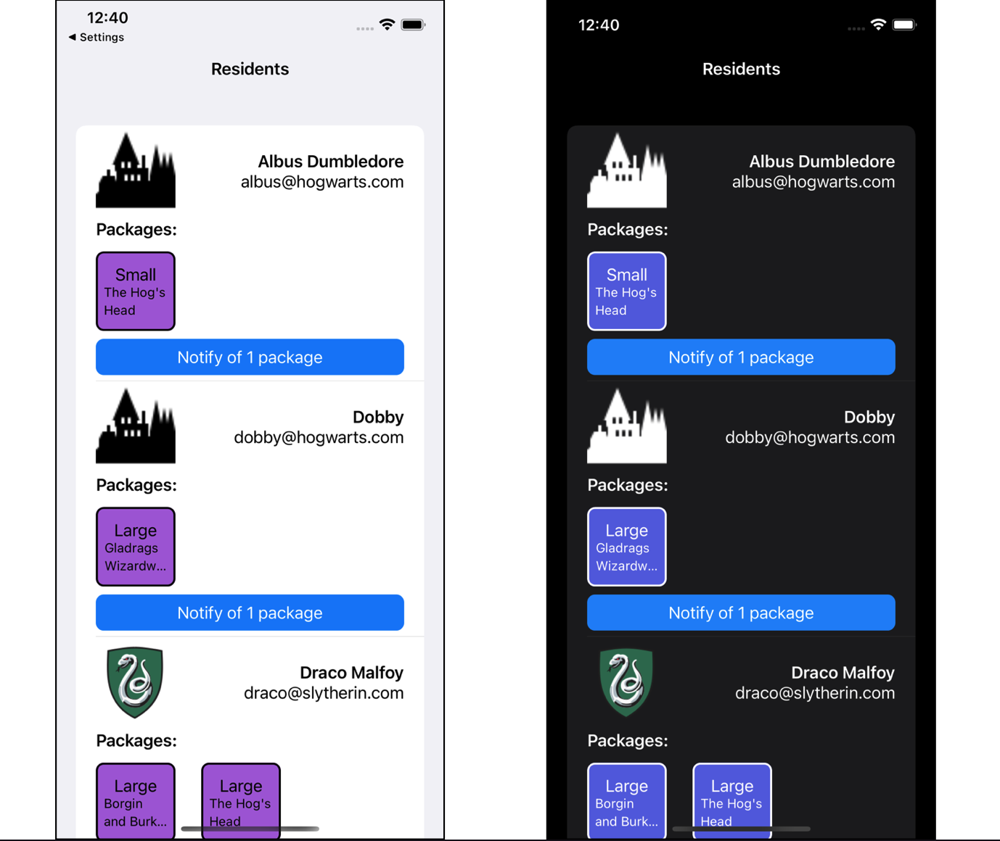

# DeliveryTracker, a prototype iOS app to track new packages for residents

DeliveryTracker is a prototype iOS app to track new packages arriving at a property, addressed to its residents.

The app follows the specifications given [here](https://www.notion.so/joindaisy/Daisy-mobile-assignment-27953941da954ba89e49a74e69198162).

## Screenshots

## Technical points

* The app is based in SwiftUI and iOS15
* No external packages have been used
* The app follows the MVVM architecture
* UI is simple and functional and supports both light and dark mode
* Sample unit tests for the model and view model layers are provided

## Demo

